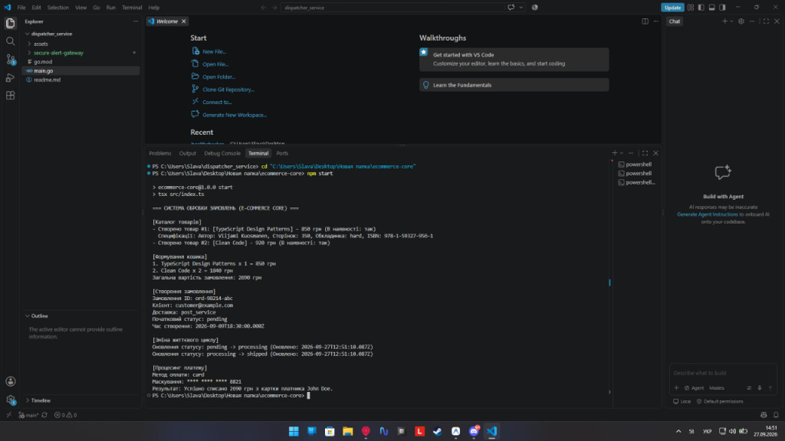
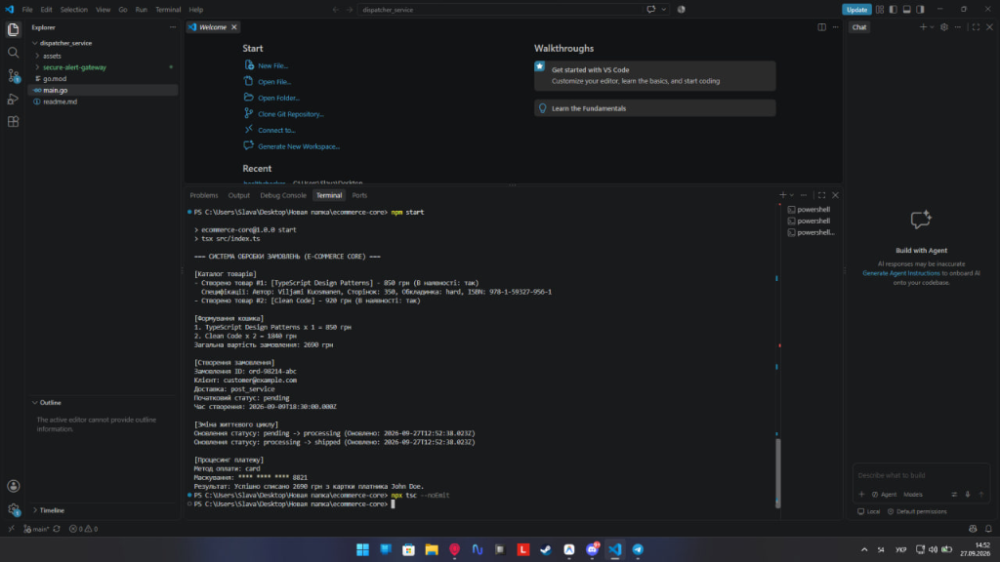

# E-Commerce Core Engine

Це практична робота №2 з дисципліни. Проєкт реалізує типізоване ядро системи інтернет-магазину (E-Commerce Core Engine) з використанням TypeScript.

## Варіант 1: Електроніка та гаджети
- **Категорія магазину:** Електроніка та гаджети
- **Специфічні характеристики:** `warrantyMonths: number`, `powerWatts?: number`, `specs: [cpu: string, ramGb: number]`
- **Варіанти доставки:** `'courier' | 'post_locker' | 'store_pickup'`

## Запуск проєкту

### Вимоги
- Node.js версії 18+
- npm

### Інсталяція
1. Встановіть залежності:
```bash
npm install
```

### Запуск програми
Виконайте скрипт `start`, який використовує `tsx` для прямого виконання TypeScript:
```bash
npm start
```

## Функціональність
Проєкт містить 3 рівні складності:
1. **Рівень 1:** Моделювання примітивів, створення `BaseProduct` та `Product` (з урахуванням варіанту), базові функції обробки каталогу.
2. **Рівень 2:** Робота з `unions`, `intersections`. Моделювання замовлення `Order`, зміна статусу та безпечна валідація невідомих зовнішніх даних (`unknown`).
3. **Рівень 3:** Discriminated Unions для платіжних систем (`PaymentDetails`), Custom Type Guards (`isCreditCardPayment`), та Exhaustive Checking (`never` в `switch`).

## Виведення роботи програми (Скриншоти)

Нижче наведено скриншоти успішної компіляції та виконання програми, що підтверджують відсутність помилок TypeScript та коректну роботу логіки.

*(Студенту: Зробіть скриншот терміналу після виконання команди `npm start` та додайте його у папку проєкту, назвавши, наприклад, `screenshot.png`. Після цього розкоментуйте рядок нижче)*

<!--  -->

*(Студенту: Також можна додати скриншот відсутності помилок компіляції `npx tsc --noEmit`)*

<!--  -->
